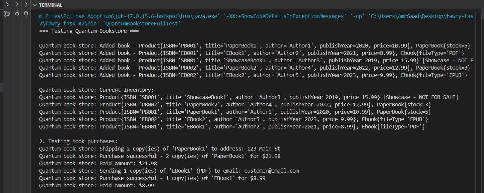
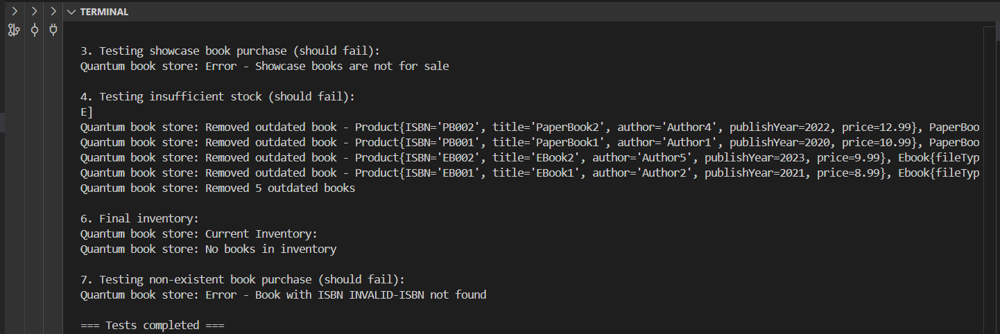

# Quantum Bookstore

## Overview

Quantum Bookstore is a Java-based application that simulates an online bookstore system. It supports different types of books (Paper Books, EBooks, and Showcase Books) with features for managing inventory, processing purchases, and handling outdated books.

## Features

- **Book Types**:
  - **PaperBook**: Physical books with stock management and shipping.
  - **EBook**: Digital books with email delivery.
  - **ShowcaseBook**: Display-only books that cannot be purchased.
- **Inventory Management**:
  - Add books to the inventory.
  - Remove outdated books based on a year threshold.
  - Display current inventory.
- **Purchase Processing**:
  - Handles purchases for PaperBooks and EBooks.
  - Validates stock for PaperBooks and prevents ShowcaseBook purchases.
  - Mock services for shipping (PaperBooks) and email delivery (EBooks).
- **Error Handling**:
  - Manages insufficient stock, invalid ISBNs, and unsupported operations.

## Project Structure

- **Book.java**: Abstract base class for all book types.
- **PaperBook.java**: Implementation for physical books with stock management.
- **EBook.java**: Implementation for digital books with file type support.
- **ShowcaseBook.java**: Implementation for non-purchasable showcase books.
- **ShippingService.java**: Mock service for shipping PaperBooks.
- **MailService.java**: Mock service for emailing EBooks.
- **QuantumBookstore.java**: Main bookstore class for managing inventory and purchases.
- **QuantumBookstoreFullTest.java**: Test class with comprehensive test cases.

## Requirements

- Java 8 or higher
- Standard Java libraries (`java.util`, `java.time`)

## Setup and Running

1. **Clone the Repository**:
   ```bash
   git clone <repository-url>
   ```
2. **Compile the Code**:
   ```bash
   javac *.java
   ```
3. **Run the Test**:
   ```bash
   java QuantumBookstoreFullTest
   ```

## Test Cases

The `QuantumBookstoreFullTest` class includes the following tests:

1. Adding various types of books to the inventory.
2. Processing successful purchases for PaperBooks and EBooks.
3. Attempting to purchase a ShowcaseBook (should fail).
4. Attempting to purchase more PaperBooks than available stock (should fail).
5. Removing outdated books based on a 3-year threshold (removes books before 2022).
6. Attempting to purchase a book that was removed as outdated (should fail).

## Sample Output

```
=== Testing Quantum Bookstore ===

1. Adding books to inventory:
Quantum book store: Added book - [PB001] PaperBook1 by Author1 (2020) - $10.99 [Paper - Stock: 5]
Quantum book store: Added book - [EB001] EBook1 by Author2 (2021) - $8.99 [EBook - PDF]
...

2. Testing book purchases:
Quantum book store: Shipping 2 copy(ies) of 'PaperBook1' to address: 123 Main St
Quantum book store: Purchase successful - 2 copy(ies) of 'PaperBook1' for $21.98
...

3. Testing showcase book purchase (should fail):
Quantum book store: Error - Showcase books are not for sale
...

5. Testing removal of outdated books (>3 years):
Quantum book store: Removed outdated book - [PB001] PaperBook1 by Author1 (2020) - $10.99 [Paper - Stock: 3]
...
Quantum book store: Removed 3 outdated books

6. Final inventory:
Quantum book store: [PB002] PaperBook2 by Author4 (2022) - $12.99 [Paper - Stock: 3]
Quantum book store: [EB002] EBook2 by Author5 (2023) - $9.99 [EBook - EPUB]

7. Testing non-existent book purchase (should fail):
Quantum book store: Error - Book with ISBN PB001 not found
```

## Usage Notes

- The system uses mock services (`ShippingService` and `MailService`) for demonstration purposes.
- The `isOutdated` method uses `java.time.LocalDate` to determine if a book is outdated based on the publication year.
- ISBNs are used as unique identifiers for books in the inventory.
- The 3-year threshold in Test 5 removes books published before 2022, affecting subsequent tests.

## screenshots




## note

I discovered that there was a recent update to the readme file through a post on Facebook and the readme file was modified.
The code was written and submitted before the deadline.

you can check through the commits date.
